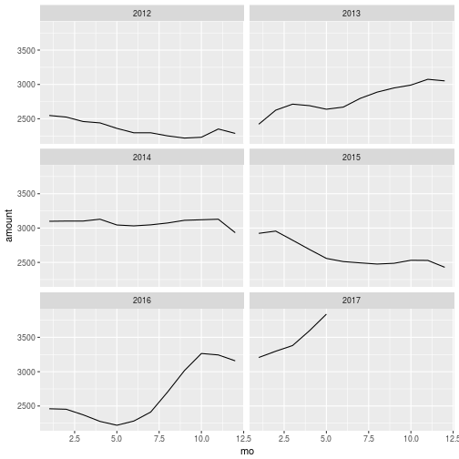
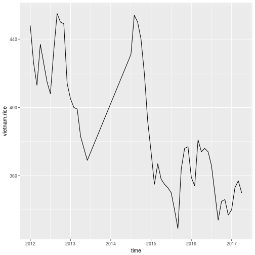
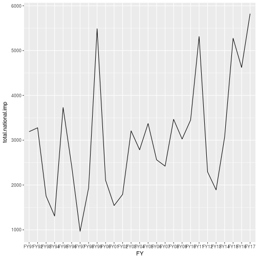
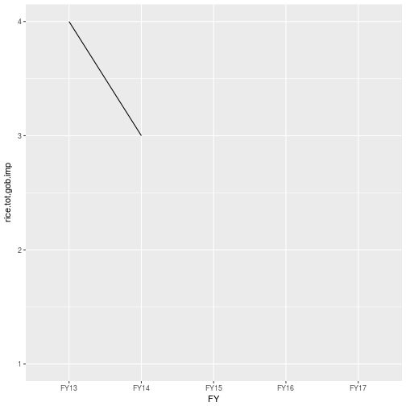

# Rice price

## Last five years

## Last two years

## Top 10 prices

In the below we see  top 10 prices in the last two decades in Bangladesh (wholesale coarse price). We find that out of this top 10 prices, 5 of those were registered in 2017. Two were recorded in 2016, October and November repectively. 

-----------------
 yrmon    amount 
-------- --------
May 2017   3838  

Apr 2017   3597  

Mar 2017   3381  

Feb 2017   3298  

Feb 2011   3272  

Oct 2016   3265  

Nov 2016   3244  

Mar 2011   3209  

Jan 2017   3207  

Apr 2008   3170  
-----------------

## Yearly price trend

# International price

## Bangladesh Bank Source (Thai price)

### Last five years

### last two years

### yearly trend

## Vietnam price

### Last five years

### last two years

### yearly trend

# Public stock of rice

## Last five years

## Last two years

## Yearly trend

# Import data

## Total national import

### Last five years

###  Last two years

## Total rice import

### Last five years

###  Last two years

## Private rice import

###  All the years

###  Last five years

## Public rice import

###  All the years

###  Last five years

# Government procurement of rice

## Last five years

## Last two years

## Yearly trend

## Year-wise procurement upto August

