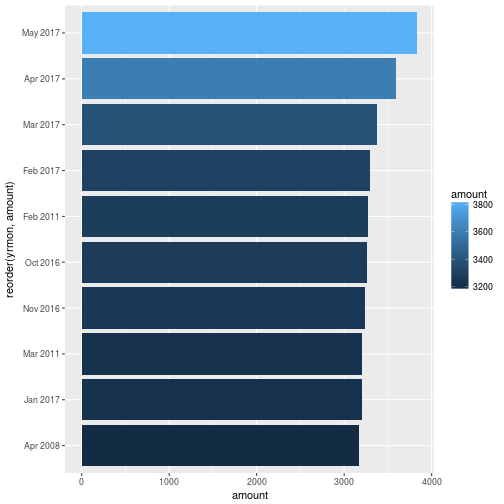
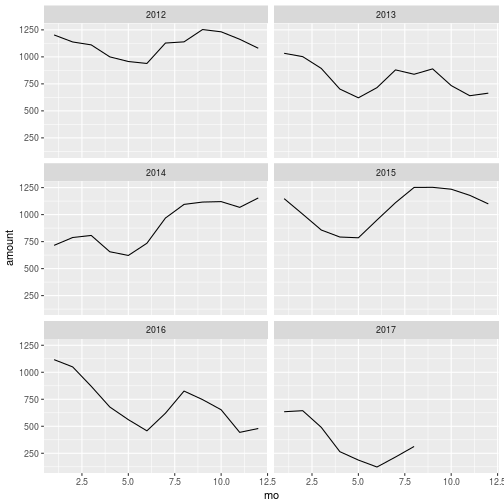
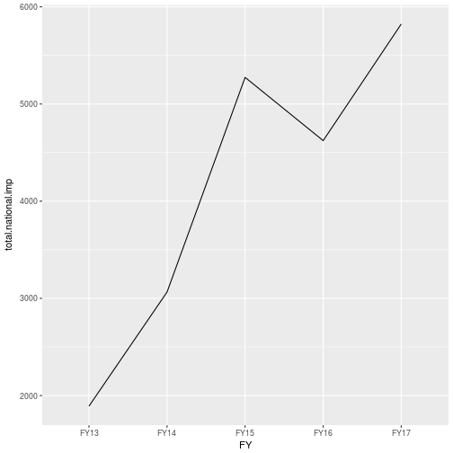
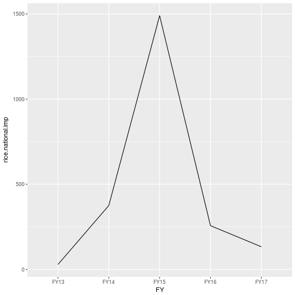
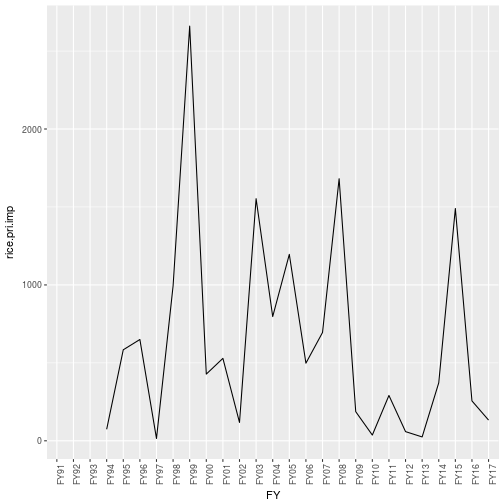
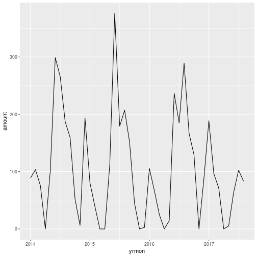
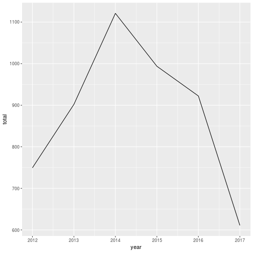

# Rice price

## Last five years

## Last two years

## Top 10 prices

In the below we see  top 10 prices in the last two decades in Bangladesh (wholesale coarse price). We find that out of this top 10 prices, 5 of those were registered in 2017. Two were recorded in 2016, October and November repectively. 

-----------------
 yrmon    amount 
-------- --------
May 2017   3838  

Apr 2017   3597  

Mar 2017   3381  

Feb 2017   3298  

Feb 2011   3272  

Oct 2016   3265  

Nov 2016   3244  

Mar 2011   3209  

Jan 2017   3207  

Apr 2008   3170  
-----------------

let's put it into graph

In the same manner we look into to 10 lowest prices in last two decades

-----------------
 yrmon    amount 
-------- --------
Jan 1997   895   

Dec 1996   910   

Nov 1996   927   

Oct 1996   931   

Aug 1997   938   

Feb 1997   943   

Sep 1997   949   

Jul 1997   957   

Mar 1997   983   

Sep 1996   992   
-----------------

In the above see that, all were back in later half of 1990s

let's try in the last 10 years

-----------------
 yrmon    amount 
-------- --------
Aug 2009   1746  

Jul 2009   1752  

Sep 2009   1782  

Jun 2009   1786  

Apr 2009   1809  

May 2009   1815  

Oct 2009   1949  

Nov 2009   1979  

Mar 2009   2024  

Dec 2009   2175  
-----------------

We find that all were recorded back in 2009

how about last 5 years

-----------------
 yrmon    amount 
-------- --------
Sep 2012   2219  

May 2016   2220  

Oct 2012   2231  

Aug 2012   2251  

Apr 2016   2276  

Jun 2016   2281  

Dec 2012   2287  

Jun 2012   2296  

Jul 2012   2296  

Nov 2012   2351  
-----------------

in the above we see that in the last 5 years, 2nd lowest price was achived in May 2016. There is  2nd lowest price was achived in May 2016. There is two other prices from 2016. All others from 2012. 

From the above analysis we see that, in 2016 we saw lowest domestic rice prices in last five years and also saw highest prices in last 5 years or 10 years. This fluctuation seems to be difficult to explain at this moment. 

## Yearly price trend

# International price

## Bangladesh Bank Source (Thai price)

### Last five years

### last two years

### yearly trend

## Vietnam price

### Last five years

### last two years

### Top 10 prices

In the below we see  top 10 prices since 2009 in vietnam price. We find that out of this top 10 prices, almost all of those were recorded in 2011. 

-----------------------
  time    vietnam.rice 
-------- --------------
Oct 2011      573      

Sep 2011      568      

Aug 2011      555      

Nov 2011      554      

Jul 2011      506      

Dec 2011      498      

Dec 2010      496      

Nov 2010      493      

Jan 2010      482      

Jan 2011      480      
-----------------------

In the same manner we look into to 10 lowest prices since 2009

-----------------------
  time    vietnam.rice 
-------- --------------
Sep 2015      329      

Sep 2016      334      

Dec 2016      337      

Aug 2015      340      

Jan 2017      340      

Oct 2016      345      

Nov 2016      346      

Jul 2015      350      

Aug 2016      350      

Apr 2017      350      
-----------------------

What we see is quite interesting. since 2009, the lowest prices were recorded in 2015, 2016 and 2017. As of April
2017, we have the 10-th lowest price since 2009. 

## Thai price

### Top 10 prices

In the below we see  top 10 prices since 2009 in vietnam price. We find that out of this top 10 prices, almost all of those were recorded in in the period between 2009 and 2011. 

---------------------
  time    thai.rice1 
-------- ------------
Nov 2011     629     

Oct 2011     615     

Sep 2011     614     

May 2012     614     

Jun 2012     612     

Dec 2011     608     

Dec 2009     605     

Jul 2009     602     

Jan 2010     596     

Jul 2012     587     
---------------------

In the same manner we look into to 10 lowest prices since 2009

---------------------
  time    thai.rice1 
-------- ------------
Dec 2015     365     

Sep 2015     366     

Nov 2016     367     

Nov 2015     371     

Jan 2016     371     

Oct 2015     373     

Oct 2016     373     

Feb 2017     376     

Mar 2017     377     

Mar 2016     379     
---------------------

What we see is quite interesting. since 2009, the lowest prices were recorded in 2015, 2016 and 2017. As of March 2017, we have the 9-th lowest price since 2009. 

### yearly trend

# Public stock of rice

## Last five years

## Last two years

### Top 10 stock values

In the below we 10 highest  public stock value of rice since 1990. We find that the latest highest was achieved in August 2015.

-----------------
 yrmon    amount 
-------- --------
Sep 2012   1253  

Sep 2015   1252  

Aug 2015   1251  

Oct 2008   1247  

Oct 2011   1244  

Oct 2015   1235  

Oct 2012   1232  

Sep 2009   1205  

Sep 2011   1205  

Jan 2012   1203  
-----------------

In the same manner we look into to 10 lowest  stock values since 1990

-----------------
 yrmon    amount 
-------- --------
Jul 2004   61.1  

May 2005   68.7  

Aug 2004    69   

Mar 1995    71   

Dec 2004    79   

Jan 2005   87.6  

Feb 1995    98   

Apr 1998   100   

Sep 2004  100.4  

Apr 2005  110.3  
-----------------

In the above we find that in the last 27 years, we did not experience any low stock values that could feature into to 10 lowest. Now let's look into last 10 years

-----------------
 yrmon    amount 
-------- --------
Jun 2017  122.9  

May 2017   187   

Apr 2007  195.3  

Jul 2017  215.4  

Apr 2008  232.7  

May 2007  252.8  

Apr 2017  264.9  

Apr 2011   284   

Apr 2010   285   

Aug 2017   313   
-----------------

what we see that we have the lowest public stock in 2017, particularly in June in last 10 years. 

## Yearly trend

# Import data

## Total national import

### Last five years

###  Last two years

## Total rice import

### Last five years

###  Last two years

## Private rice import

###  All the years

###  Last five years

## Public rice import

###  All the years

###  Last five years

# Government procurement of rice

## Last five years

## Last two years

## Yearly trend

## Year-wise procurement upto August

